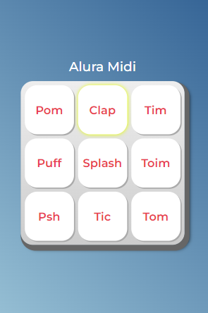

# Alura Midi

## Projeto do Curso de JavaScript da Alura

 Nesse projeto foi utilizado funções com parâmetro e função anônima, eventos de mouse e teclado, for loop para percorer os elementos html, e condicionais.

#### Funcionalidade:
 
 Ao clicar em um botão, tocará o audio referente ao botão clicado.

